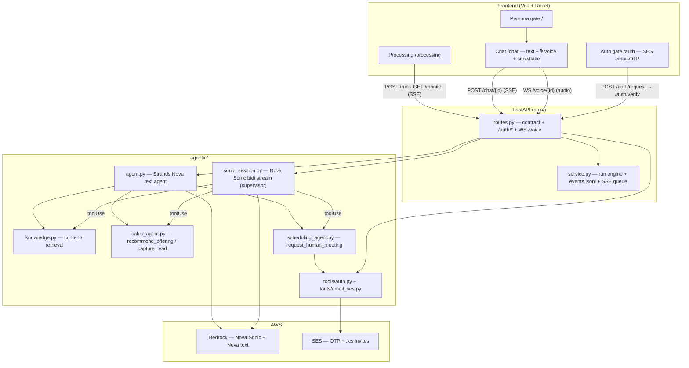

# Trianz Concierge (agent5) — Architecture

> A cross-modal (voice + text) front door for Trianz. A verified business visitor
> talks to it by **voice (Amazon Nova Sonic)** or **text (SSE)**; it explains Trianz's
> offerings grounded in a knowledge base, qualifies interest, and books a human
> conversation by email. Served verbatim by `GET /architecture`.

## Overview

The frontend opens on a **real access gate** — SES email-OTP — *before* the persona
gate. A visitor enters a work email; the backend checks it against a wildcard allowlist
and a public-domain blocklist, then sends a 6-digit code via **AWS SES** (or returns a
dev code when SES isn't configured). After verifying, the visitor picks a persona
(*Prospect*, *Trianz Sales*, *Administrator*) and lands on **Chat**.

Three flows dominate:

1. **Voice (Nova Sonic)** — the browser captures mic audio (16 kHz PCM) and streams it
   over a **WebSocket** (`/voice/{id}`) to `SonicSession`, which drives the Bedrock
   **bidirectional** stream. Sonic is the *supervisor*: on a `toolUse` event it calls the
   shared tool layer (knowledge / sales / scheduling), returns the result, and streams
   24 kHz speech + transcripts back to the browser, which plays the audio and animates a
   reactive snowflake visualiser.
2. **Text (SSE)** — `POST /chat/{id}` streams a Strands **Nova text** agent that carries
   the *same* tools, so voice and text behave identically. Both require a verified session.
3. **Processing** — `POST /run` launches the generic engine (Sales/Admin only) with a
   durable HITL gate; `GET /monitor/{id}` replays `events.jsonl` past `Last-Event-ID` then
   attaches to the live queue, surviving refreshes.

## Request flow

## Authentication (real SES email-OTP gate)

`tools/auth.py` validates the email (`fnmatch` allowlist like `*.trianz.com`; a
public-provider blocklist), mints a 6-digit code with `secrets`, persists a durable
challenge under `state/auth/`, and sends it via `tools/email_ses.py` (SESv2). Verifying
issues a durable session token; the WS, `/chat`, and `/run` require it (401 otherwise).
This is a deliberate departure from the template note that "personas are not auth" — here
personas remain a view, and SES verification is the real gate. With no `ses_sender`
configured the code is returned as `dev_code` so the flow runs with zero AWS setup.

## Voice loop (Nova Sonic)

`SonicSession` owns the event protocol: `sessionStart → promptStart` (advertising the
tool specs + 24 kHz audio output) → a SYSTEM prompt → user `audioInput` frames → output
`textOutput`/`audioOutput` and `toolUse`. Tool calls dispatch to the same functions the
text path uses; results are returned as a `toolResult` content block. The bidirectional
client lives in the experimental `aws-sdk-bedrock-runtime`; if it (or AWS creds) is
absent, the WS sends one `error` with `fallback:true` and the UI stays on text.

## Knowledge

`knowledge.py` ingests `content/` (`.md`/`.txt`/`.html`) on boot into a rebuildable
keyword index at `state/index/knowledge.json`, and exposes `search_trianz_knowledge`.
The agent grounds every Trianz claim in retrieved passages; `00-overview.*` also seeds
the opening pitch.

## Sub-agents (as tools)

- **Sales** — `recommend_offering(need)` (knowledge-grounded) and `capture_lead(...)` →
  durable JSON under `state/data/leads/`.
- **Scheduling** — `request_human_meeting(...)` builds a hand-rolled `.ics` invite, emails
  it via SES, and records the booking under `state/data/meetings/`. No CRM, no OAuth.

## State, resumability, self-check

All mutable data lives under `state/` (`auth/`, `data/leads`, `data/meetings`, `sessions/`,
`runs/`, `index/`, `logs/`). `events.jsonl` + monotonic ids give resumable SSE; durable
HITL gates in `state/runs/` survive restart. `GET /ping` self-check reports
`awaiting_setup | ok | degraded` plus informative checks for the model, knowledge index,
SES sender, and voice backend.

## Constraints

Single uvicorn worker (in-process HITL + Sonic sessions). The agent owns all of its own
tools, prompts, scenarios, and memory — no shared modules. No pricing anywhere.
