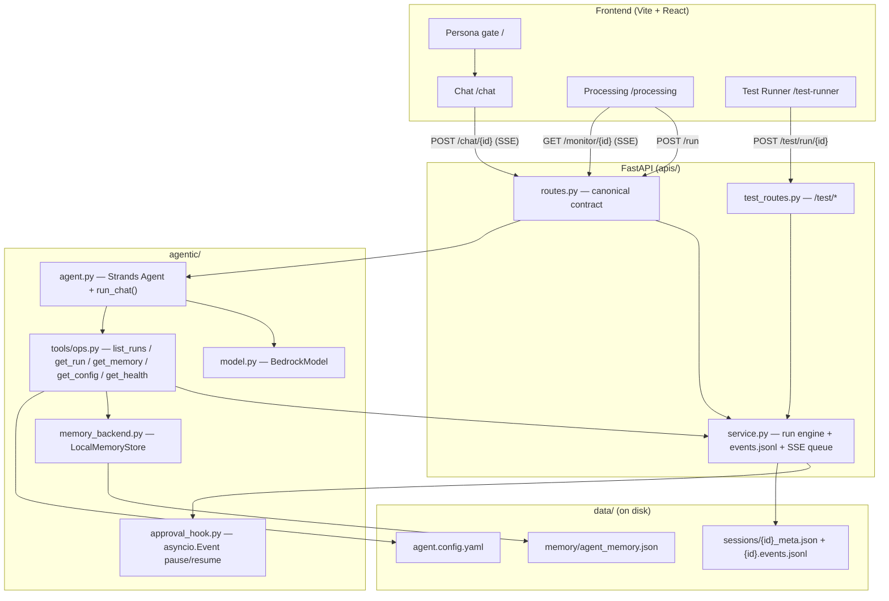

# DemoX v2.0 — Agent Architecture

> The v2.0 agent template. A persona-aware, operations-aware assistant with a
> generic processing pipeline, resumable live output, human-in-the-loop
> approval, and a self-test harness. This page is served verbatim by
> `GET /architecture` and rendered on the Architecture page.

## Overview

A new agent copied from this template ships a standalone Vite frontend and a
FastAPI backend. The frontend opens on a **persona gate**: the user picks
*Customer*, *Support*, or *Administrator*, and that choice drives which ribbon
pages are visible and lands them on **Chat**. Every page talks to the backend
over the canonical API contract.

Two flows dominate:

1. **Chat** — `POST /chat/{session_id}` streams an SSE response. The Strands
   agent is persona-aware and **operations-aware**: it carries read-only tools
   (`list_runs`, `get_run`, `get_memory`, `get_config`, `get_health`) so it can
   answer questions about the agent's own runs, memory, configuration, and
   health by reading on-disk state.
2. **Processing** — `POST /run` mints a `run_id`, persists session metadata, and
   launches a generic pipeline coroutine as a detached `asyncio` task. The
   pipeline emits `pipeline-step` events, optionally pauses at a HITL approval
   gate, then emits `done`. `GET /monitor/{id}` is an SSE stream that **replays
   `events.jsonl` past a `Last-Event-ID` cursor, then attaches to the live
   in-memory queue** — so the page survives a refresh.

## Request flow

## Pipeline + HITL

`run_pipeline(session_id)` walks a small set of generic steps, emitting a
`pipeline-step` event for each. When `features.hitl_approval` is true it raises a
`human-approval-required` event, sets status `awaiting_approval`, and awaits an
`asyncio.Future`. `POST /approve/{id}` or `POST /reject/{id}` resolves that
future via the `ApprovalHook`; the run then finishes with a `done` event and
status `complete`. When HITL is disabled the approve/reject endpoints return
`{"status":"approvals-disabled"}` so the contract stays uniform.

## State, events, and resumability

- **Session meta** (`{id}_meta.json`) holds status, `run_id`, timestamps, and a
  monotonic `event_count`.
- **`{id}.events.jsonl`** is an append-only log; each event is stamped with a
  monotonic `id` and an ISO timestamp. SSE replay uses these ids as the
  `Last-Event-ID` cursor.
- On startup, `startup_sweep()` marks any non-terminal run as `interrupted`
  (crash recovery), and `self_check()` validates the Bedrock config, resolved
  model id, and that `agent.config.yaml` parses — feeding `GET /ping`'s
  `ok | degraded` status and the Command Center readiness tile.

## Self-test harness

`data/test_scenarios/*.json` each declare `id`, `name`, `description`, `tags`,
`payload`, and an `expected` block of assertions (e.g. final status, minimum
event count). `POST /test/run/{id}` injects the scenario, runs the real
pipeline, evaluates `expected`, and emits a `test-result` event with pass/fail —
making the agent self-demonstrable with zero external setup.

## Constraints

Single uvicorn worker: HITL approval futures live in process memory, so the task
awaiting approval and the route resolving it must be in the same process. All
paths are agent-relative; the agent owns all of its own tools, prompts,
scenarios, and memory — there are no shared/common tool modules.
