# Agentic AI Platform — Architecture

> **Living reference — kept current.** Decision history lives in `specs/done/`.

**Stack:** React · Python FastAPI · AWS Strands SDK · AWS Bedrock AgentCore (future)

**Agents (isolated — no cross-agent communication):** Claims Processing · Underwriting · Loan Processing

**Mode:** Demo — no authentication

---

## 1. System Architecture

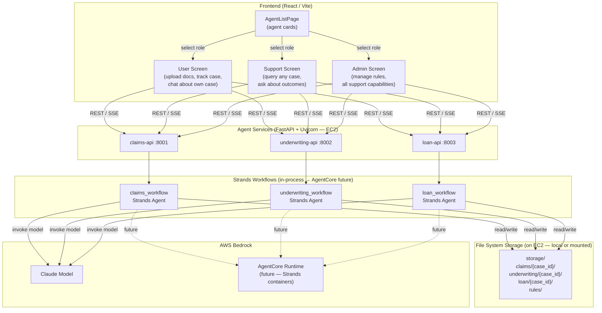

---

## 2. Project Folder Structure

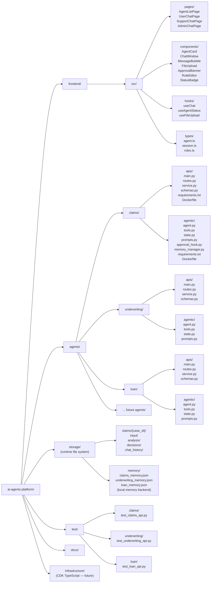

---

## 3. Three Screens Per Agent

Each agent exposes the same chat interface but with role-specific capabilities.

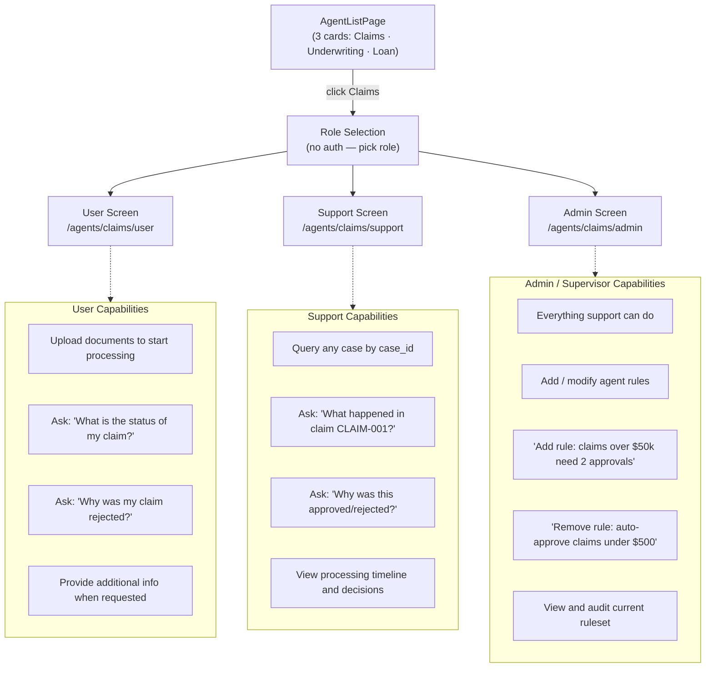

---

## 4. Frontend Component Tree

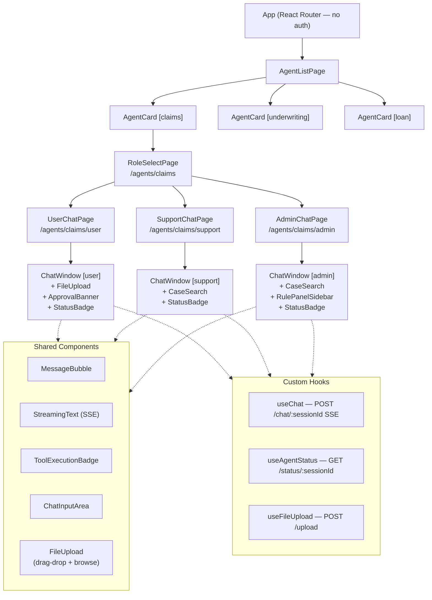

---

## 5. API Contract (identical shape for every agent)

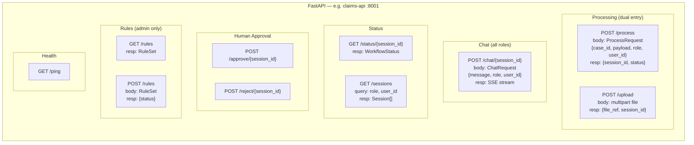

---

## 6. Dual Entry Point — Document Submission

Documents can be submitted via the chat window **or** directly via the `/process` API (e.g., from test scripts).

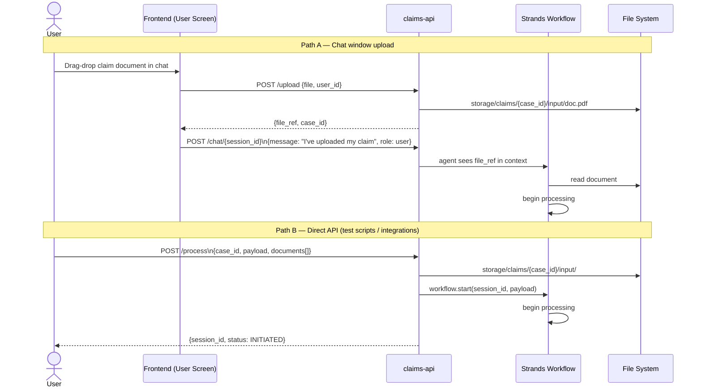

---

## 7. Workflow State Machine

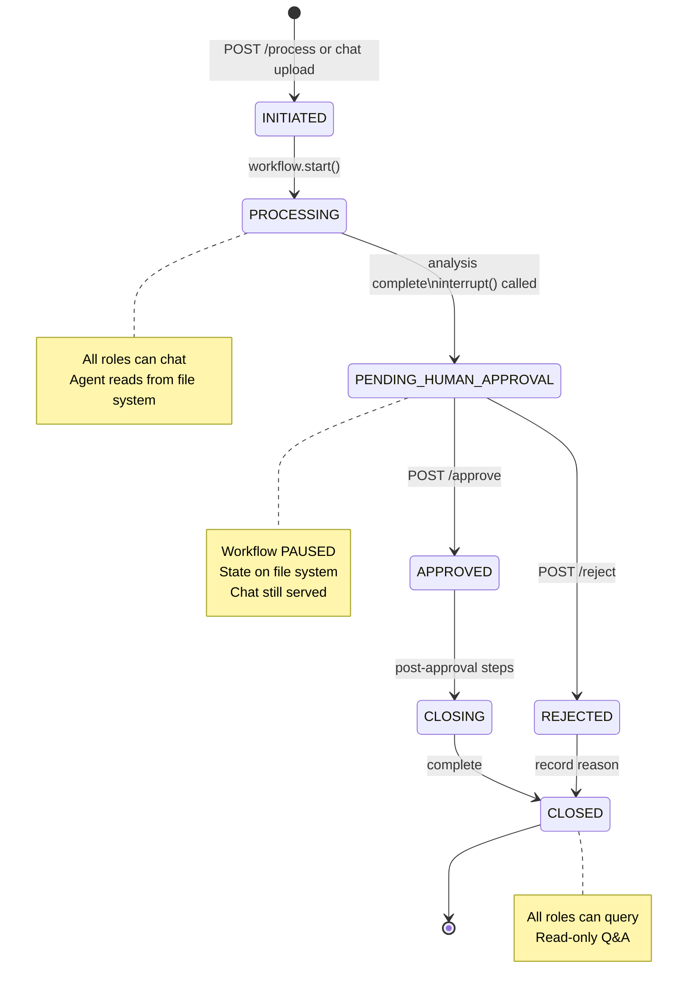

---

## 8. Processing Flow — End-to-End

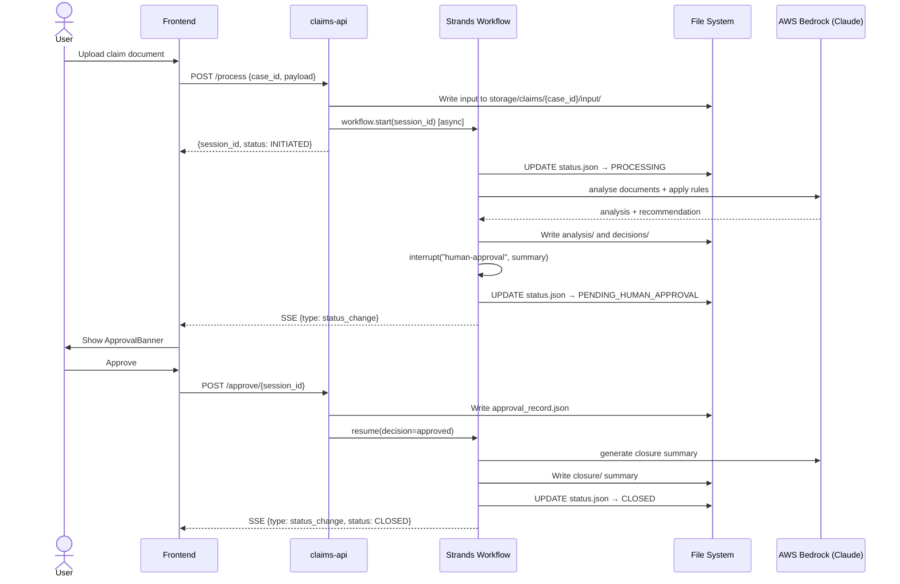

---

## 9. Chat Flow — SSE Streaming (all roles)

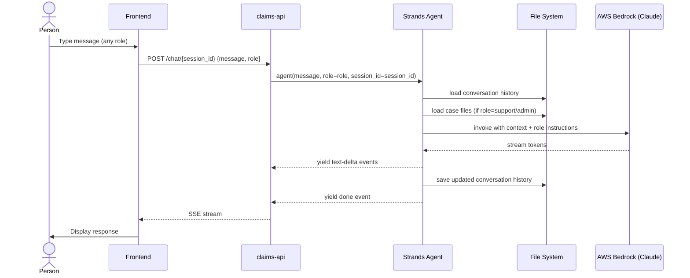

---

## 10. Human-in-the-Loop — Pause / Resume

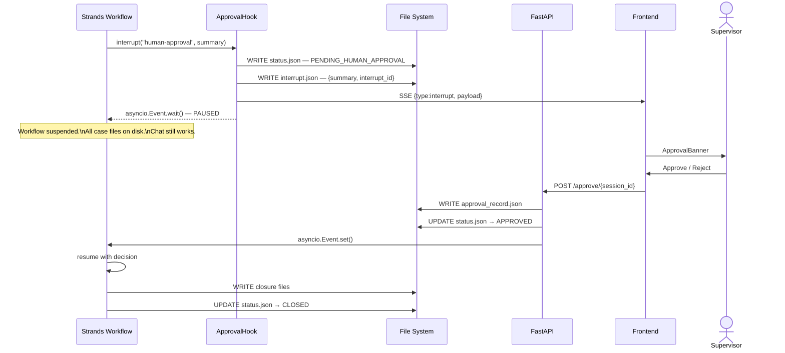

---

## 11. Agent Memory — Rules Storage

Rules are stored in agent memory — **not** on the file system. Locally this is a JSON-backed `LocalMemoryStore`; on AgentCore it becomes `AgentCoreMemorySessionManager` with no code change.

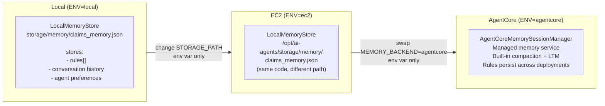

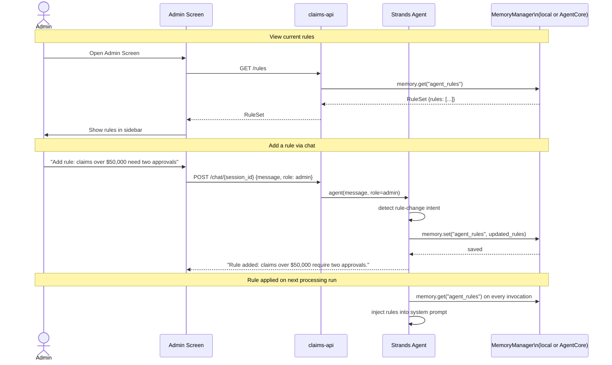

---

## 12. File System Storage Layout

All **processing artifacts** live on the file system. **Rules live in agent memory** (separate). Support and admin query the agent to look up any case.

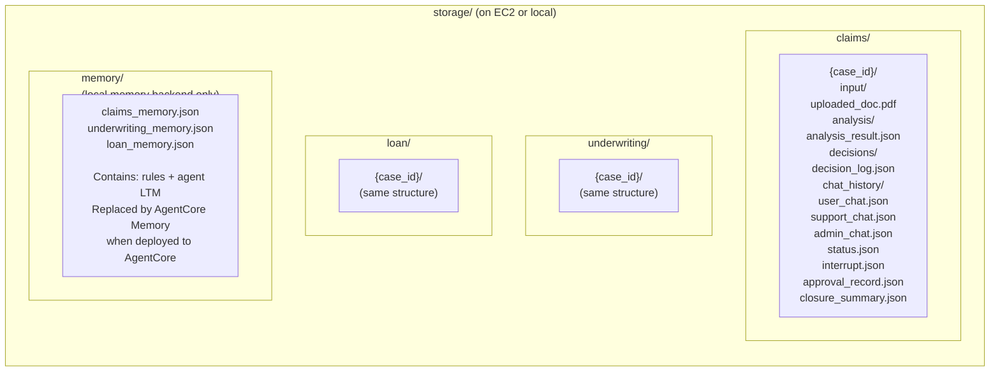

---

## 13. Agent Module Internal Architecture

> Claims shown — Underwriting and Loan are structurally identical.

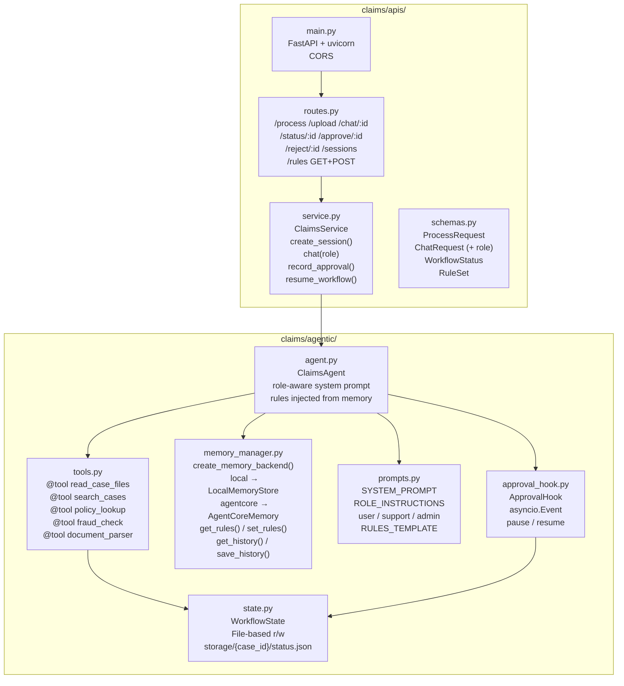

---

## 14. Deployment Architecture

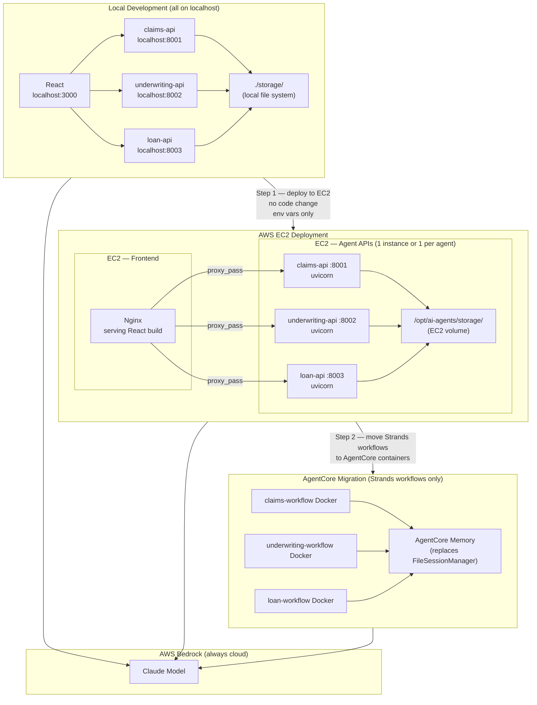

### Environment Config Matrix

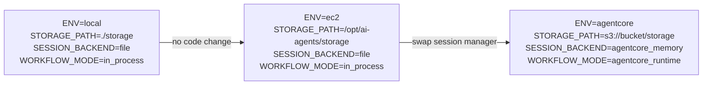

---

## 15. Implementation Phases

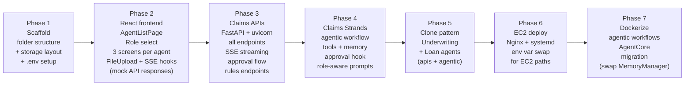

---

## Key Reference Files (sample code)

| Reference file | Pattern used for |
|---|---|
| `agent-blueprint/agentcore-runtime-a2a-stack/research-agent/src/main.py` | MetadataAwareExecutor, session isolation, streaming |
| `agent-blueprint/agentcore-runtime-a2a-stack/research-agent/src/report_manager.py` | File-based session workspace, path validation, thread-safe writes |
| `agent-blueprint/agentcore-runtime-mcp-stack/src/mcp_server.py` | FastAPI + AgentCore entrypoint |
| `agent-blueprint/agentcore-runtime-mcp-stack/Dockerfile` | Container packaging for AgentCore |
| `agent-blueprint/agentcore-gateway-stack/infrastructure/lib/gateway-stack.ts` | CDK MCP Gateway with SigV4 |
| `agent-blueprint/agentcore-runtime-stack/lib/agent-runtime-stack.ts` | ECR + IAM + CodeBuild CDK |

---

## Design Decisions

| Decision | Choice | Reason |
|---|---|---|
| Auth | None (demo) | Simplicity — role is passed as a param in each request |
| Storage | Local file system | Zero-infra, portable, human-readable, queryable by agent tools |
| Rule storage | Agent memory (`LocalMemoryStore` locally, `AgentCoreMemory` on AgentCore) | Rules are part of agent LTM — portable, no separate file path, swapped via env var |
| Agent role awareness | `role` param in ChatRequest → injected into system prompt | Single agent serves all 3 screens with role-specific behaviour |
| Document entry | Chat upload OR POST /process API | Supports both interactive and programmatic submission |
| Human approval pause | `asyncio.Event` in workflow coroutine | Non-blocking, state survives on FS, resumable without restart |
| Streaming | Server-Sent Events (SSE) | Simpler than WebSockets for unidirectional token streaming |
| Hosting | EC2 + Nginx (not Fargate) | Simple, directly accessible, no orchestration overhead for demo |
| AgentCore migration | Swap `FileSessionManager` → `AgentCoreMemorySessionManager` via env var | Zero code change to migrate Strands workflow to cloud runtime |
